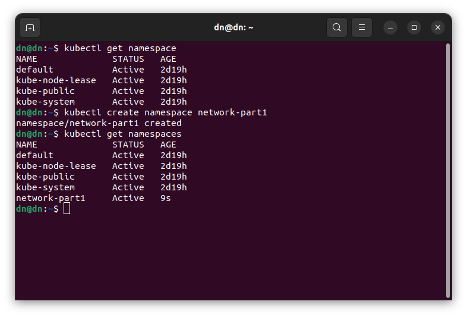
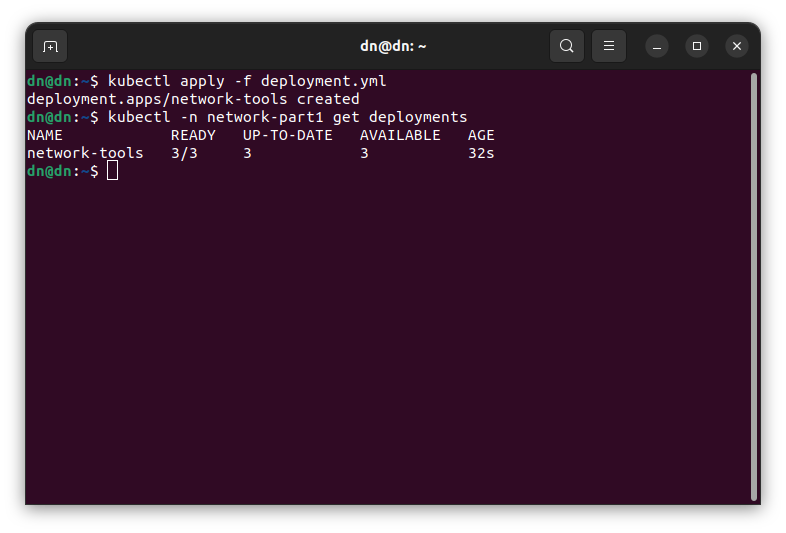
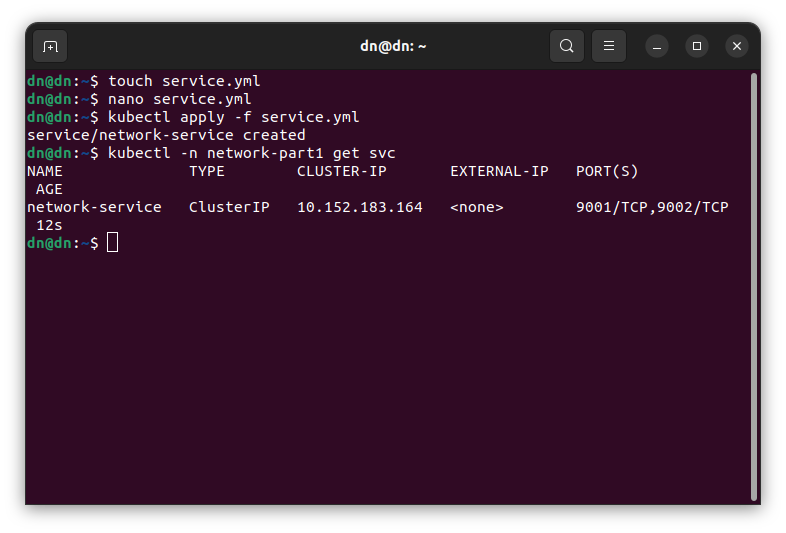
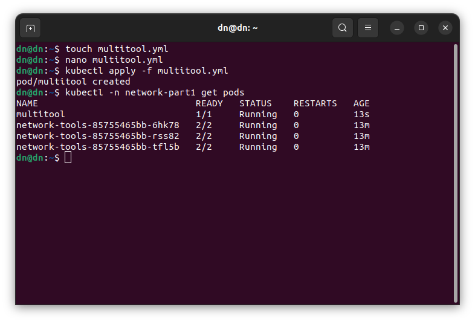
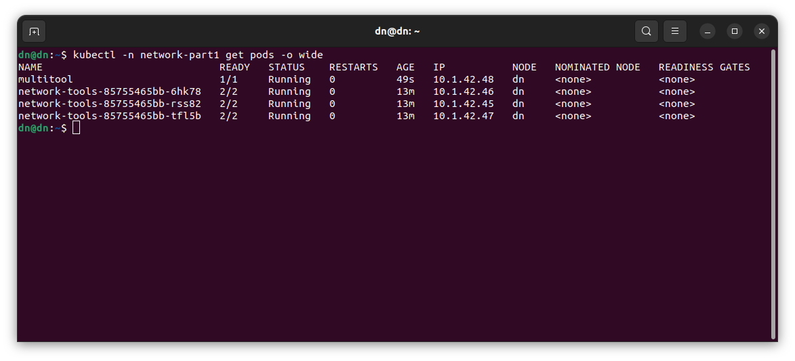
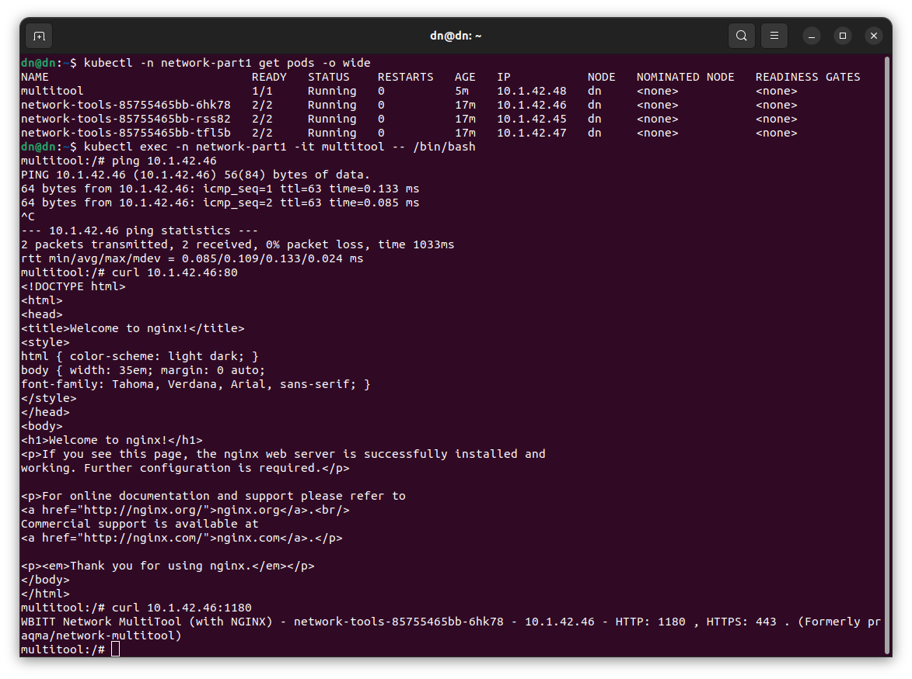
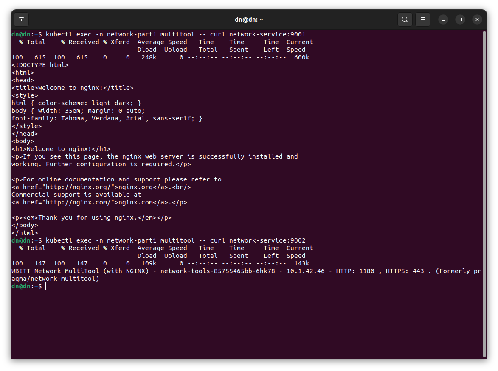
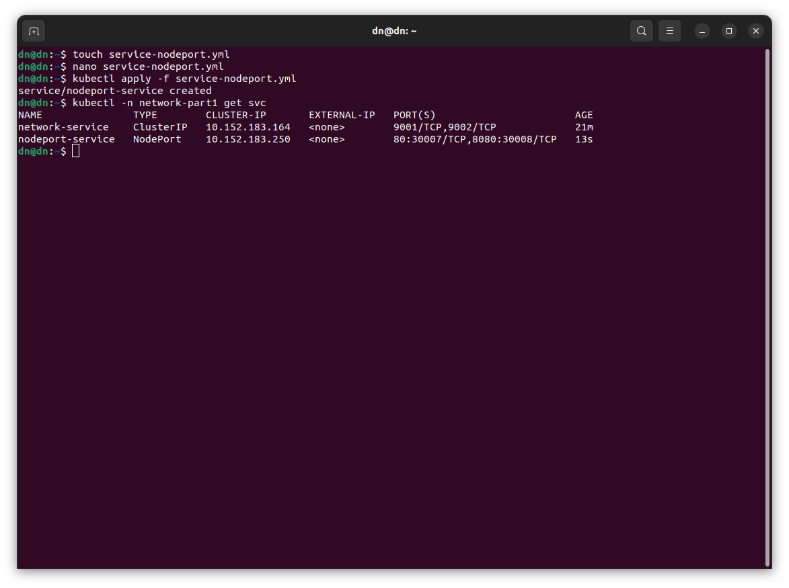
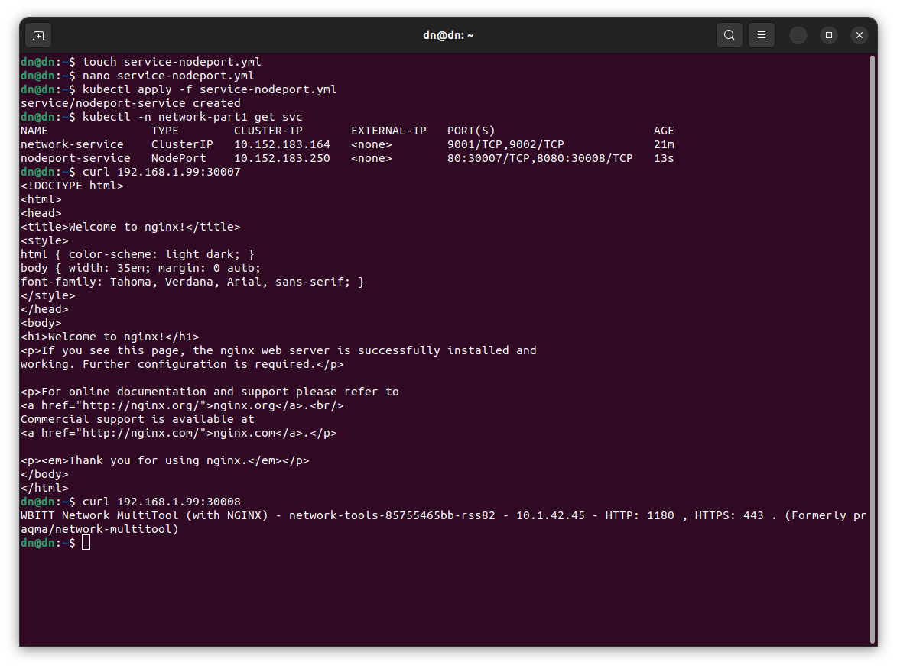

# Никоноров Денис - FOPS-8
# Домашнее задание к занятию «Сетевое взаимодействие в K8S. Часть 1»

### Задание 1. Создать Deployment и обеспечить доступ к контейнерам приложения по разным портам из другого Pod внутри кластера

1. Создать Deployment приложения, состоящего из двух контейнеров (nginx и multitool), с количеством реплик 3 шт.
2. Создать Service, который обеспечит доступ внутри кластера до контейнеров приложения из п.1 по порту 9001 — nginx 80, по 9002 — multitool 8080.
3. Создать отдельный Pod с приложением multitool и убедиться с помощью `curl`, что из пода есть доступ до приложения из п.1 по разным портам в разные контейнеры.
4. Продемонстрировать доступ с помощью `curl` по доменному имени сервиса.
5. Предоставить манифесты Deployment и Service в решении, а также скриншоты или вывод команды п.4.

------

### Задание 2. Создать Service и обеспечить доступ к приложениям снаружи кластера

1. Создать отдельный Service приложения из Задания 1 с возможностью доступа снаружи кластера к nginx, используя тип NodePort.
2. Продемонстрировать доступ с помощью браузера или `curl` с локального компьютера.
3. Предоставить манифест и Service в решении, а также скриншоты или вывод команды п.2.

---

### Решение задания 1. Создать Deployment и обеспечить доступ к контейнерам приложения по разным портам из другого Pod внутри кластера

Удален namespace `netology` из прошлой домашки и создан новый namespace `network-part1`

Написан манифест [deployment](/deployment.yml) состоящего из двух контейнеров nginx и multitool, 3-мярепликами.

Запуск и проверка. Видно что реплик 3.

Написан манифест [service](/service.yml), который обеспечит доступ внутри кластера до контейнеров из п.1 по порту 9001 - nginx 80, по 9002 - multitool 8080.

Запуск и проверка. Видно что сервис создался и слушает порты 9001, 9002.

Написан манифест [multitool](/multitool.yml)

Проверка адресов запущеный подов.

Подключение к поду `multitool` проверка курлом доступность приложений в подах по одному из IP адресов

Так же проверим доступность по доменному имени.

### Решение заданиия 2. Создать Service и обеспечить доступ к приложениям снаружи кластера

Создан отдельный манифест сервиса [service-nodeport](/service-nodeport.yml) для возможности доступа снаружи кластера к nginx используя тип NodePort

Сервис запущен с внешними портами 30007 и 30008.

Проверка `curl` доступ к приложениям.

